# Pre-requisites

Before starting Lab 1, make sure you have the following pre-requisites in place:

1. Access to Workshop Infrastructure.
   - Verify Access to Strigo. Url will be shared during the workshop.
   - Verify Access to GitHub.
2. Workshop will be driven using Elastic Cloud Instance. Hence create an account on Elastic Cloud.
   - Open [Elastic Cloud Trial](https://www.elastic.co/cloud/cloudtrial-overview) and follow the steps below
   - Use your business email id to sign up for the free trial (left pane).
    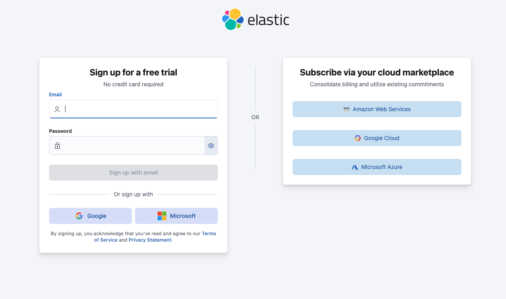
   - Provide the details as requested & you can validate the account later.
   - Create first deployment. Provide the name in the format suggested. Feel free to change it per your preference.
     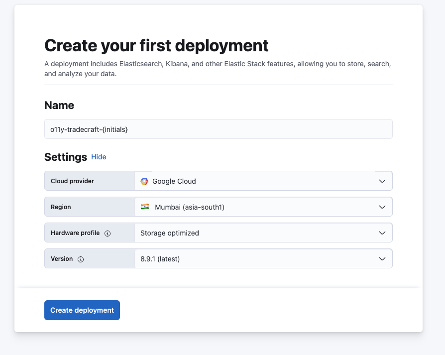
   - Once you click on create deploy you will be provided the __elastic__ user password. Please copy it, you will need it in subsequent labs.
    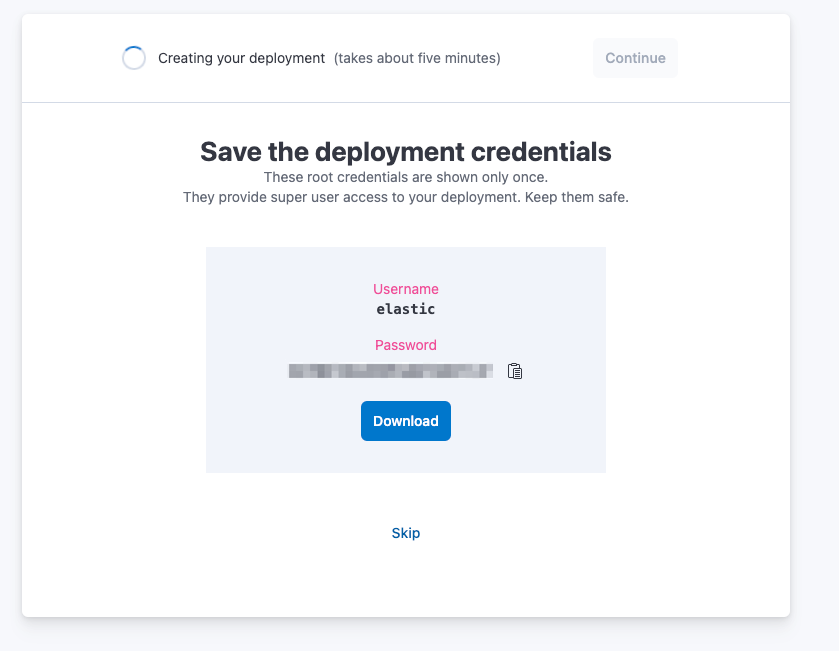
   - Click on __contiue__ and this takes you to the below screen.
     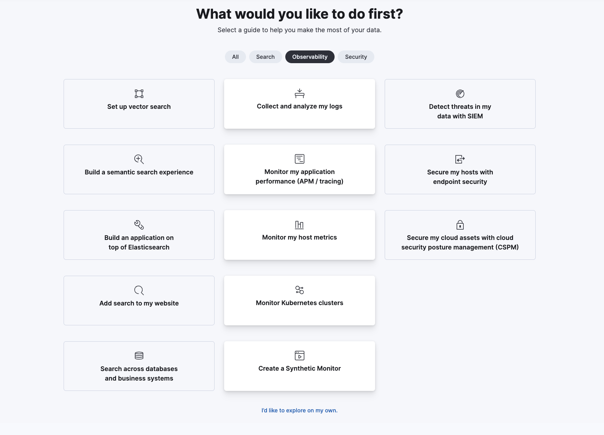
   - Select "I’d like to explore on my own." at the very bottom 
   - You now have a working Elastic Cloud Instance at your service.
3. Updating Cloud Instance
   - Click on Manage this Deployment 
     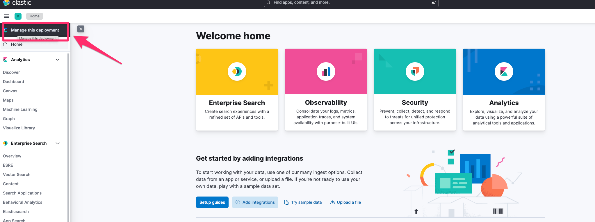
   - This is where we will include ML nodes in your deployment.
   - Select Edit Deployment 
     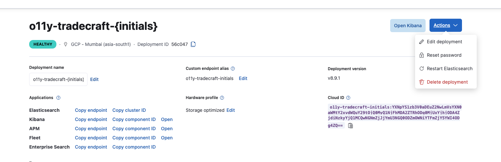
   - And add ML Nodes and Save the deployment. Keep everything else as is.
     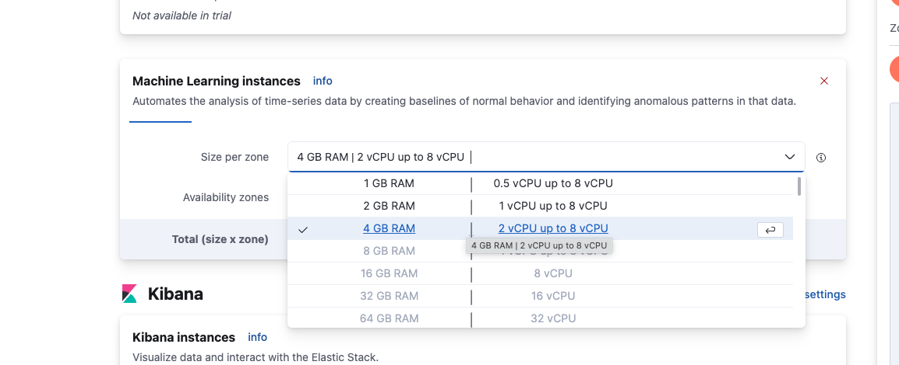
4. Open Kibana with the credentials captured earlier in step 2.

You now have a trial instance of Elastic Cloud.

---

# Lab 1

## Uptime 

The Uptime app is for viewing result data from lightweight monitors running through Heartbeat and configured with a traditional heartbeat.yml file. This is for TCP, HTTP or ICMP monitors that you have configured and run from your own infrastructure with Heartbeat natively.

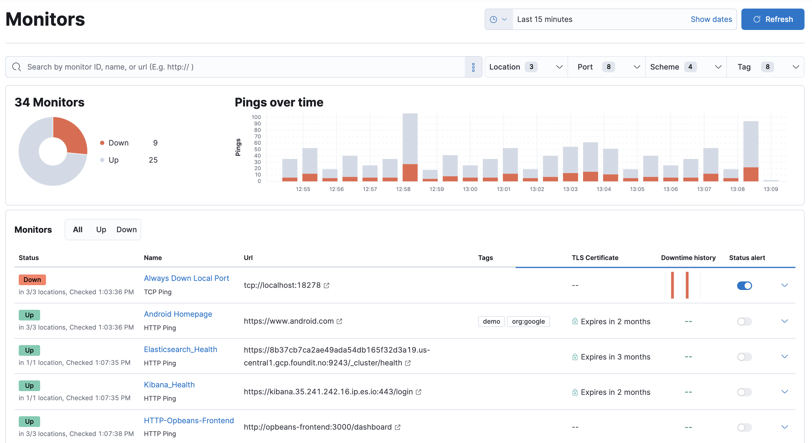

The lab walks you through installing hearbeat on the lab VM and then configuring it to provide additional insights.

1. Navigate to Integrations. 
2. Search for Uptime
  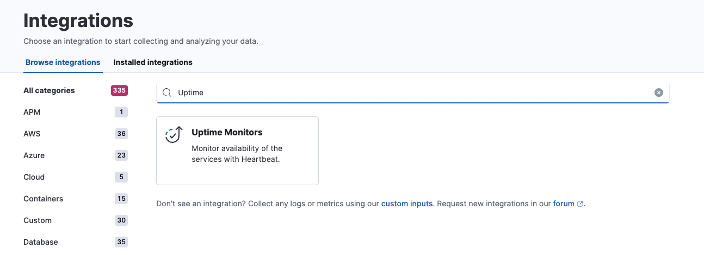
1. Follow the steps prompted in the page, execute them in the lab machine and view the Uptime App.
  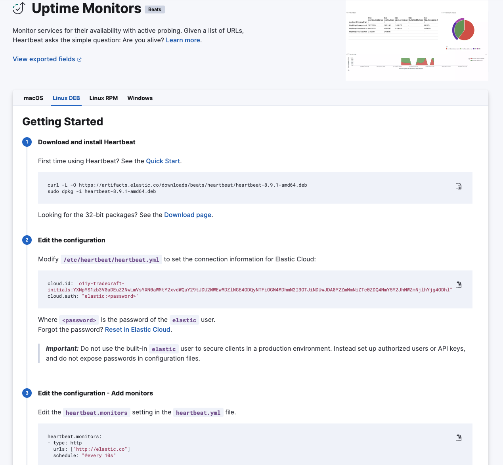
1. We will now enhance the file to enrich the data. Update the hearbeat.yml file to include the following.
    ```yaml
        
    heartbeat.monitors:
    - type: http
      id: elastic-homepage
      name: Elastic.co Homepage
      hosts: ["https://elastic.co"]
      schedule: '@every 10m

    


2. Make sure you follow these steps on kibana - to get visualization of legacy uptime under observability

    

    

3. Lets now create some custom visualizations too.
   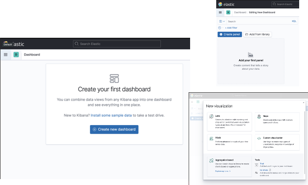
4. Create a visualization thats displays External HTTP Roundtrip latency per domain. It should look something like below.  
   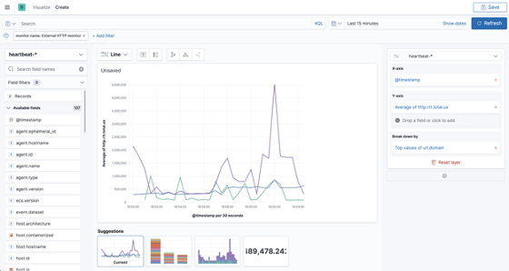

___

## Synthetics.

> Due to the constraints of the Lab environment, we will try installing and running the synthetics recorder on your machine. If your organization IT policies do not allow installation of the synthetics, please use the below script.

1. Use the playwright script recorded for a website.
   ```javascript
      step('Go to https://news.ycombinator.com/', async () => {
        await page.goto('https://news.ycombinator.com/', {
            timeout: 0,
            waitUntil: 'load'
        });
      });
      step('Go to https://news.ycombinator.com/newest', async () => {
        await page.goto('https://news.ycombinator.com/newest', {
            timeout: 0,
            waitUntil: 'load'
        });
      });
      step('Go to https://news.ycombinator.com/front', async () => {
        await page.goto('https://news.ycombinator.com/front', {
            timeout: 0,
            waitUntil: 'load'
        });
      });
      step('Go to https://news.ycombinator.com/ask', async () => {
        await page.goto('https://news.ycombinator.com/ask', {
            timeout: 0,
            waitUntil: 'load'
        });
      });
    ```
2. Navigate to Monitor at Observability --> Synthetics. Enter the details as per the screenshot below
   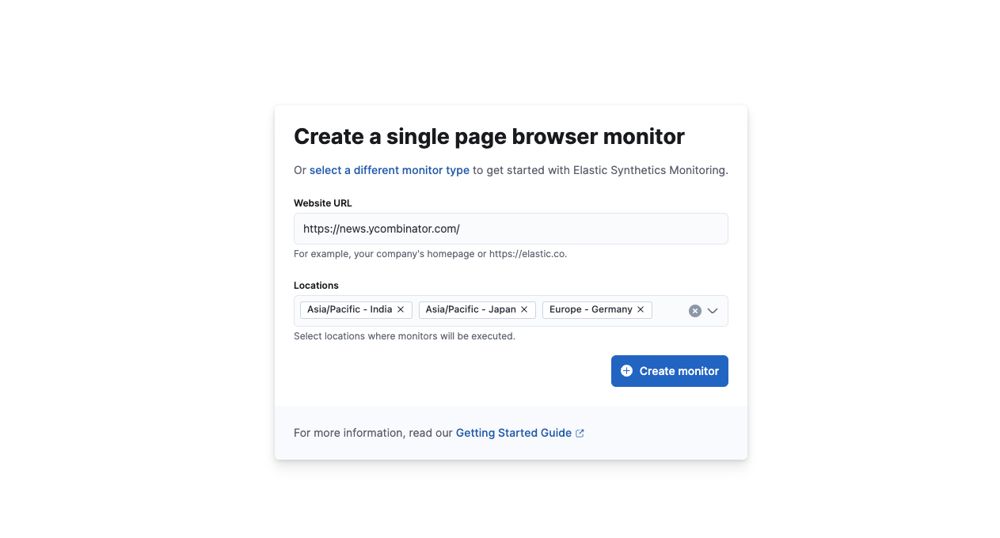
   You could choose any other url, but the script would have to change accordingly. 
3. Create a multi step monitor. In the script editor, copy paste the snippet from step 1 above.
   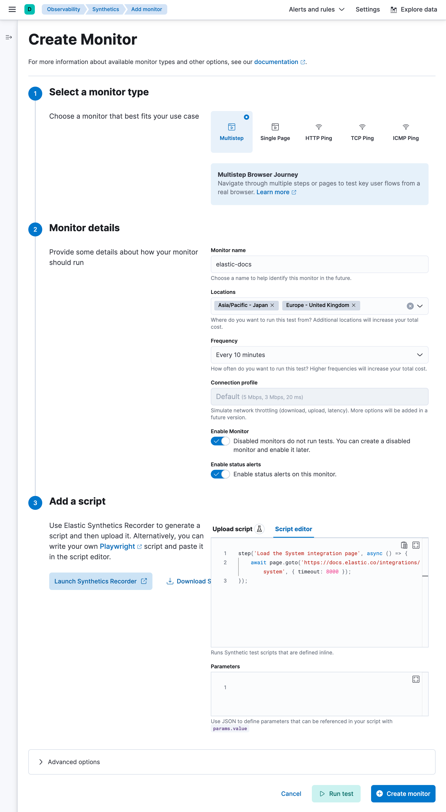


4. Create TCP/HTTP/Single Step Browser testing


 


>                End Of Lab 1.
