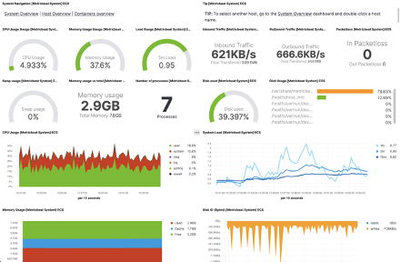
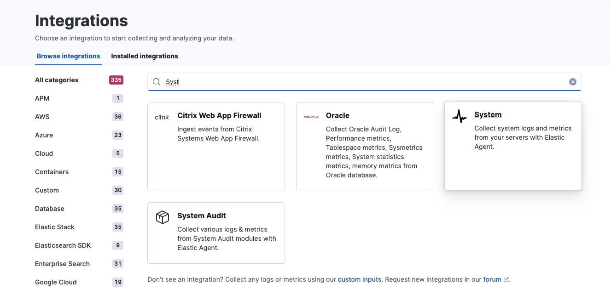
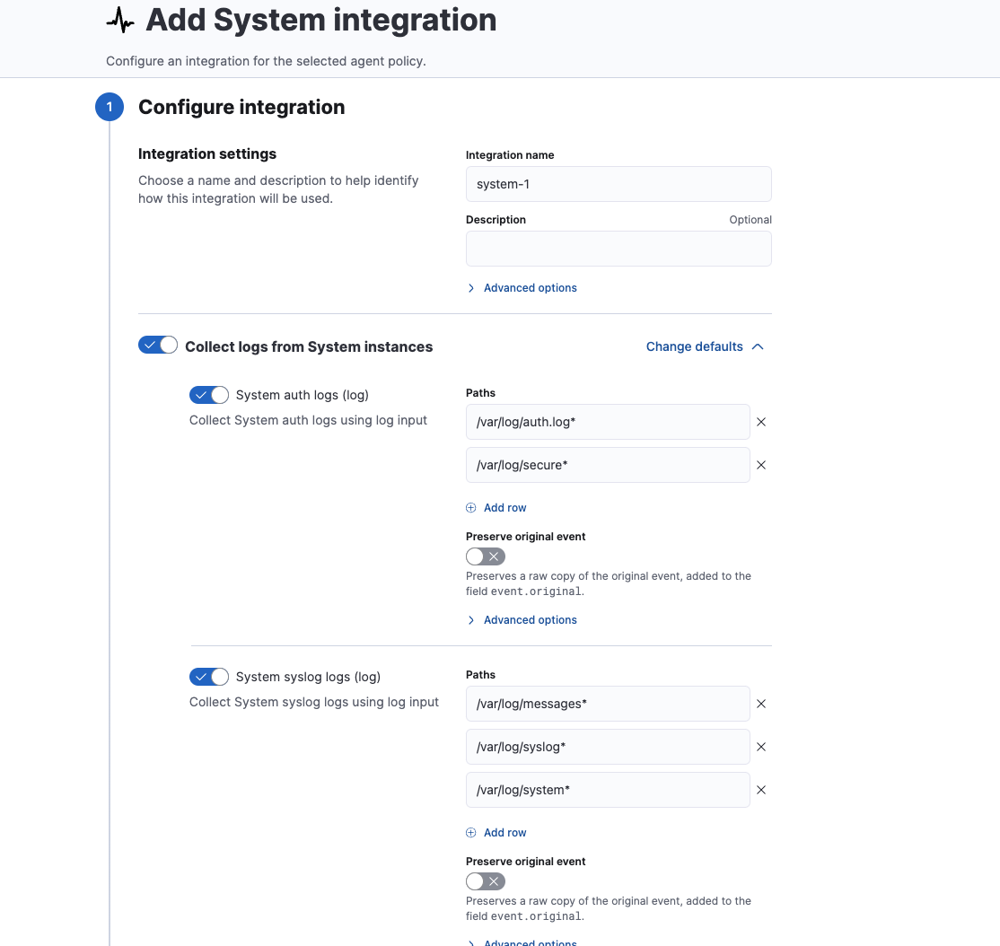
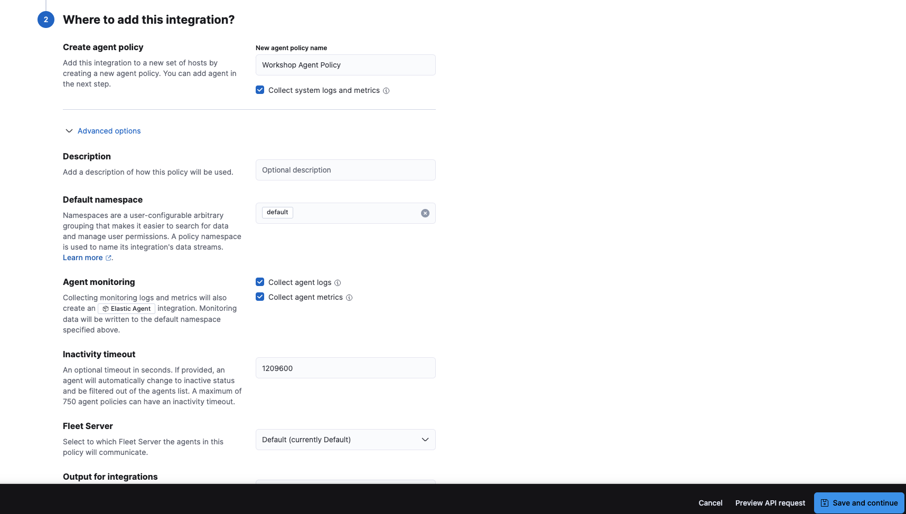
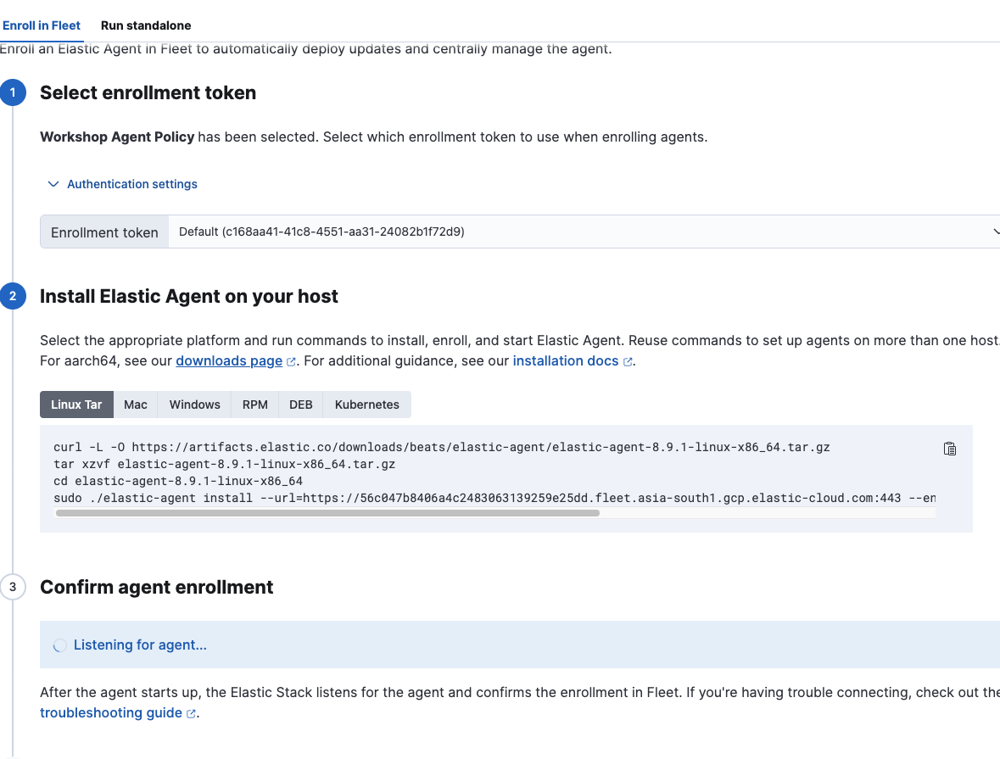
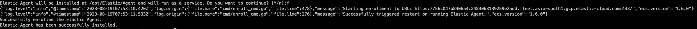
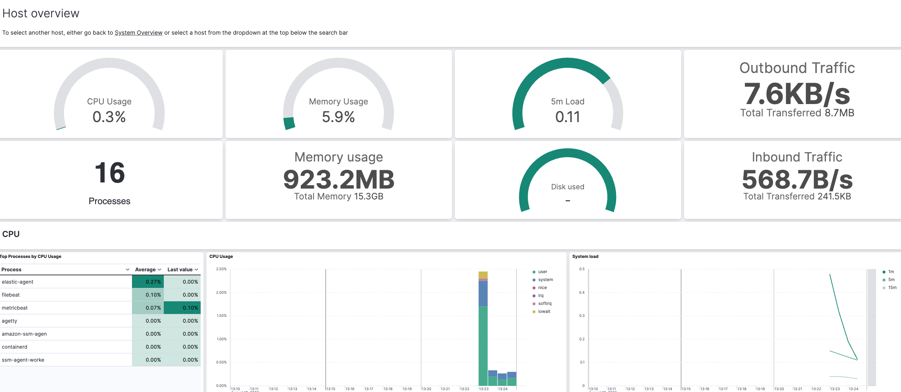
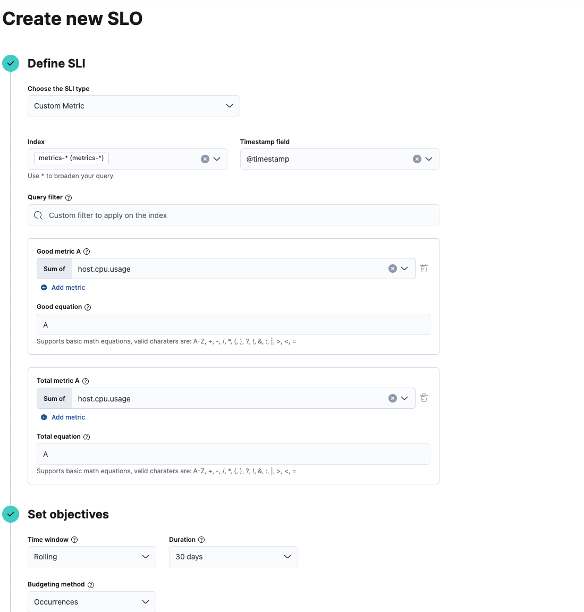

# Lab 2

We now start with Lab 2. The pre-requisites remain the same as for Lab 1.

This lab will cover setting up MetricBeats, Elastic agent and then use the to configure SLO Monitoring.

### Metricbeat Setup

We will be using the same Elastic Cloud instance provisioned earlier.
>*For additional details please visit: https://www.elastic.co/guide/en/beats/metricbeat/current/metricbeat-installation-configuration.html*

1. Log into your lab virtual machine.
2. We are using the latest versions available. Please update the versions as per your need.
3. Create a directory for Metricbeat download.
   ```bash
   mkdir -p lab2/metricbeat
   cd lab2/metricbeat
   curl -L -O https://artifacts.elastic.co/downloads/beats/metricbeat/metricbeat-8.8.2-amd64.deb
   sudo dpkg -i metricbeat-8.8.2-amd64.deb
   ```
4. Navigate to the metricbeat.yml file location and update *metricbeat.yml* to include Elastic Cloud configuration.
   ```bash
   cd /etc/metricbeat
   sudo vi metricbeat.yml
   ```   
   ```yml
   cloud.id: "xxxxxxxxxxx"
   cloud.auth: "username:password" 
   ```
5. Metricbeat comes with predefined assets for parsing, indexing, and visualizing your data. 
   To load these assets run the below commands
   ```bash
   cd /etc/metricbeat
   metricbeat setup -e
   ```
   This will take a couple of mins to load the required assets into your Elastic cloud instance.
6. Start the metricbeat service.
   ```bash
    sudo service metricbeat start
   ```
7. As data ships to Elastic, you should see something similar to below screenshot.
    

8. You can customize this further. Lets use docker-compose to setup nginx and monitor metrics using metricbeat.


### Elastic agent setup.

1. We will now setup System monitoring using Elastic Agent.
2. Login to your Elastic Cloud Instance and navigate to Integrations.
   
3. Leave the input defaults as is and scroll to the bottom of the page.
   
4. Provide a name for the agent policy and click on "*Save and Continue*".
   
5. This will now prompt you to add an Elastic agent to your host. Follow through the steps suggested in the screen.
   
6. As you run through the commands, you will be prompted as below. Successful installation will show up as below.
   
7. If you now navigate to the Host Overview Dashboard you will see the bundled dashboard with data from the Elastic agent.
   
   
9. You can also see additional assets which provide insights into system logs and events
    

   

 10. You can also check insight into Agent info, health, integration health

  

  

   

  


  
 11. 
    
---
### SLO

SLOs allow you to set clear, measurable targets for your service performance, based on factors like availability, response times, error rates, and other key metrics. You can define SLOs based on different types of data sources, such as custom KQL queries and APM latency or availability data.

Once you’ve defined your SLOs, you can monitor them in real time, with detailed dashboards and alerts that help you quickly identify and troubleshoot any issues that may arise. You can also track your progress against your SLO targets over time, with a clear view of your error budgets and burn rates

| Term         | Definition                                                                 |
|--------------|-----------------------------------------------------------------------------|
| SLI          | The measurement of your service’s performance, such as service latency or availability. |
| SLO          | The target you set for your SLI. It specifies the level of performance you expect from your service over a period of time. |
| Error budget | The amount of time that your SLI can not meet the SLO target before it violates your SLO. |
| Burn rate    | The rate at which your service consumes your error budget.                    |

An example of how SLOs show up once you configure it for your requirements is as below.


1. Navigate to Observability --> SLO and Click on Create SLO.
2. Enter the following details. Feel free to explore other options in the SLO configuration. We will setup alerting later as we progress through the workshop.
   

>                        End Of Lab 2.


