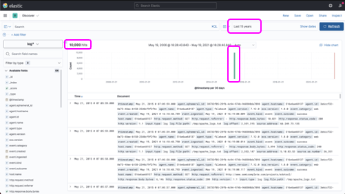
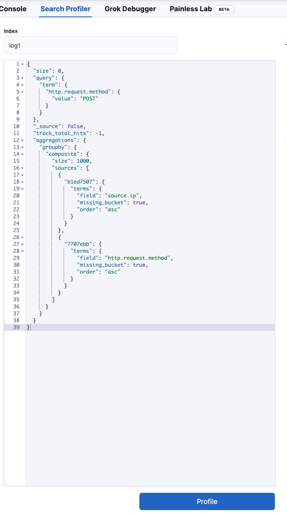

# Lab 3

We now start with Lab 3.

This lab will cover setting up Filebeats to ship logs.

### Filebeat Setup

We will be using a dockerized version of Elasticsearch for this lab.

1. Log into your lab virtual machine.
2. We will be using a docker based setup to ship log files on two different filebeat setups.
3. Copy the files into
    ```bash
     
     sudo sysctl -w vm.max_map_count=262144
     mkdir -p lab3/apps
     cd lab3/apps
     # Copy or create the docker-compose files along with the lab assets)
     # Export tag to relevant version of container images.
     export TAG=8.9.1
     docker-compose up -d
    ```
4. This will bring up an Elastic and Kibana instance with filebeat configured to ship data.
5. Open up the url for Kibana --> Use the Lab Machine IP Address. http://{lab-vm-fqdn}:5601
6. Open up DevTools and run the following commands
   ```js
      GET _data_stream

      GET _cat/indices?v
   ```
   You will see the two different indices and datastreams created for the apache logs.
7. Run the following commands
   ```js
      // Check out the fields _source-only index log1 (Schema on read example)
      GET log1/_search
      {
         "size": 3,
         "_source": false,
         "fields": ["*"]
      }
      // This is a fully indexed log2 (Schema on write example) 
      GET log2/_search
      {
         "size": 3, 
         "_source": false,
         "fields": ["*"]
      }
   ```
   Explore the differences in the output.

   Check the index template json file.
   ```json
     {
      "index_patterns": ["log1*"],
      "template": {
         "mappings": {
               "_source": {
                  "enabled": true
               }, 
               "dynamic": false,
               "properties": {}
         }
      }
     }
   ```
   The template above, stores the original message, doesn't allow dynamic field mapping and there are no indexed fields.
8. Now create a data view with Name and Pattern as "log*" and "@timestamp" as time field. 
9. View log* in Discover and change time to 15 years.
    
10. Define the runtime mappings for log1. We are re-creating the parsed fields of log2 at runtime
      ```js
         PUT log1/_mappings
         {
            "runtime": {
               "@timestamp": {
                  "type": "date"
               },  
               "message": {
                  "type": "keyword"
               },
               "source.ip": {
                  "type": "ip",
                  "script": {
                  "source": """
                     String source_ip=grok('%{IP:source_ip}').extract(params["_source"].message)?.source_ip;
                     if (source_ip != null) emit(source_ip);
                  """
                  }
               },
               "http.request.method": {
                  "type": "keyword",
                  "script": {
                  "source": """
                  String verb=dissect('%{} "%{verb} %{} HTTP/%{}" %{} %{}').extract(params["_source"].message)?.verb;
                  if (verb != null) emit(verb);
                  """
                  }
               }
            }
         }
      ```
      ```js
         // View the old and the new runtime fields in log1
         GET log1/_search
         {
         "size": 3, 
         "_source": false,
         "fields": ["*"]
         }
      ```
11. Compare the output of the two indexes
      ```js
         // Run SQL query that uses runtime fields from log1
         POST _sql?format=txt
         {
         "query": """
         SELECT "source.ip", "http.request.method", COUNT(*) AS count FROM log1 
         WHERE "http.request.method" = 'POST'
         GROUP BY source.ip, http.request.method 
         ORDER BY count DESC 
         """
         }

         // Run SQL query from log2 that produces identical results to the previos query
         POST _sql?format=txt
         {
         "query": """
         SELECT "source.ip", "http.request.method", COUNT(*) AS count FROM log2 
         WHERE "http.request.method" = 'POST'
         GROUP BY source.ip, http.request.method 
         ORDER BY count DESC 
         """
         }
      ```
12. Lets translate the query into Elasticsearch query for performance analysis.
      ```js
         // Translate the SQL query into an equivalent Elasticsearch query for performance analysis
         POST _sql/translate
         {
         "query": """
         SELECT "source.ip", "http.request.method", COUNT(*) AS count FROM log1 
         WHERE "http.request.method" = 'POST'
         GROUP BY source.ip, http.request.method 
         ORDER BY count DESC 
         """
         }
      ```
      
   Keep the output handy.
   
13. Under Devtools --> Search Profiler Copy the output and profile it for log1 and log2. What do you see?
     

14. Create a new index.
      ```js
      // Create index log3 and define mappings for schema on write. "DELETE log3" it if exists
         PUT log3
         { 
         "settings": {
            "number_of_replicas": 0,
            "number_of_shards": 1
         },
         "mappings": { 
            "_source": {
               "enabled": true
            }, 
            "dynamic": false,
            "properties": {
               "@timestamp": {
               "type": "date"
               },  
               "message": {
               "type": "text"
               },
               "source": {
               "properties": {
                  "ip": {
                     "type": "ip"
                  }
               }
               },
               "http": {
               "properties": {
                  "request": {
                     "properties": {
                     "method": {
                        "type": "keyword"
                     }
                     }
                  }
               }
               }
            }
         }
         }
      ```
15. Create the ingest pipeline that creates the two fields
    ```js
      PUT _ingest/pipeline/log3_pipeline
      {
         "processors": [
            {
               "grok": {
               "field": "message",
               "patterns": [
                  "%{IP:source.ip}"
               ]
               }
            },
            {
               "dissect": {
               "field": "message",
               "pattern": "%{} \"%{http.request.method} %{} HTTP/%{}\" %{} %{}"
               }
            }
         ]
      }
    ```
16. Reindex log1 into log3 using log3_pipeline to process the records
    ```js
      POST _reindex
      {
         "source": {
            "index": "log1"
         },
         "dest": {
            "index": "log3",
            "pipeline": "log3_pipeline"
         }
      }
    ```
17. Check out the new reindexed log3 (schema-on-write) 
    ```js
      GET log3/_search
      {
      "size": 3, 
      "_source": false,
      "fields": ["*"]
      }
    ```
18. Search the new index using SQL 
    ```js
      POST _sql?format=txt
      {
         "query": """
         SELECT "source.ip", "http.request.method", COUNT(*) AS count FROM log3 
         WHERE "http.request.method" = 'POST'
         GROUP BY source.ip, http.request.method 
         ORDER BY count DESC 
         """
      }
    ```
19. Translate it for Performance testing.
    ```js
      POST _sql/translate
      {
         "query": """
         SELECT "source.ip", "http.request.method", COUNT(*) AS count FROM log3 
         WHERE "http.request.method" = 'POST'
         GROUP BY source.ip, http.request.method 
         ORDER BY count DESC 
         """
      }
    ```
    Keep the output handy and repeat step 13. What do you see?
---
